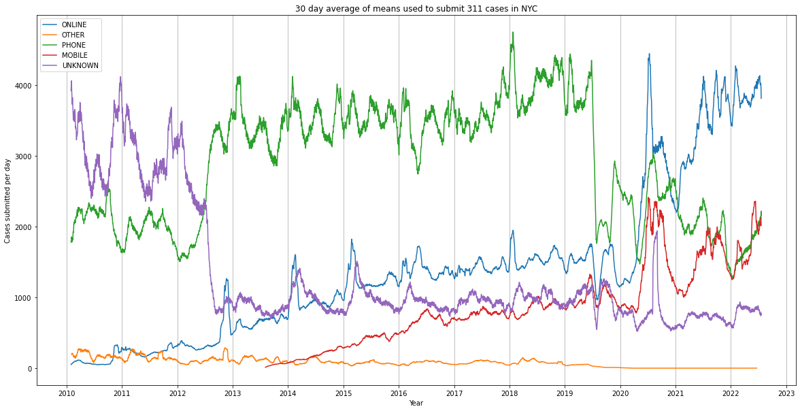

# Management of Scientific Data - Exam

## Overview

This project was created as part of an exam to demonstrate how Data Management for a project may be handeled.

This project (i.e. `runme.ipynb`) aggregates data from NYC Open Data Portal to evaluate how 311 Service Requests are submitted in NYC and how that has changed over time. This repo does not contain any data. [ProvBook](https://github.com/Sheeba-Samuel/ProvBook) was used to include provenance information in the Jupyter Notebook.
## Steps
- pull data from NYC Open Data via their SODA API (https://lvngd.com/blog/accessing-nyc-open-data-with-python-and-the-socrata-open-data-api/)
- cache it to impove runtime for repeated executions
- aggregates it using Pandas
- create a plot using Matplotlib

## Result

# About this Repositry
## Author

Maximilian Enderling

## License

MIT (See license file)

## Keywords

New York City, NYC, 311, Service, Emergency, Aggregation